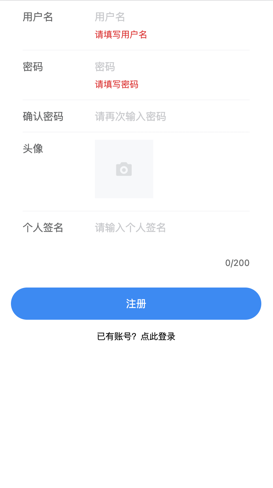
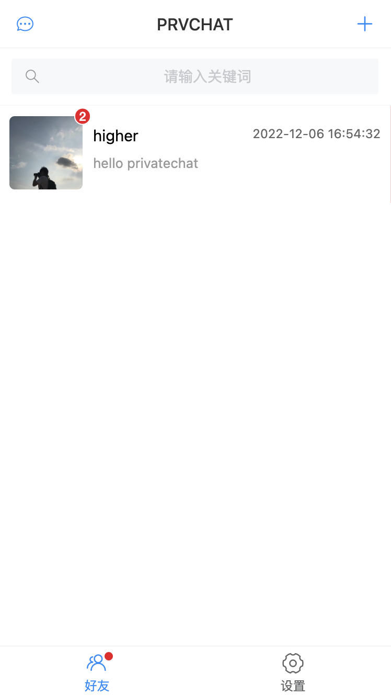
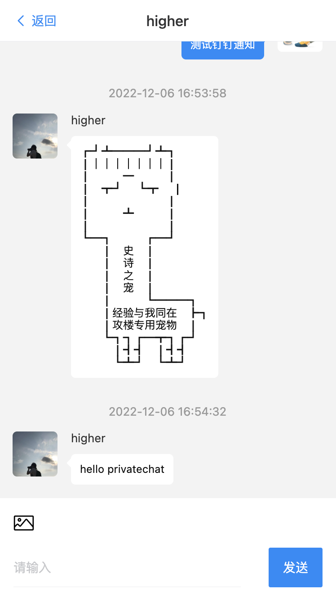
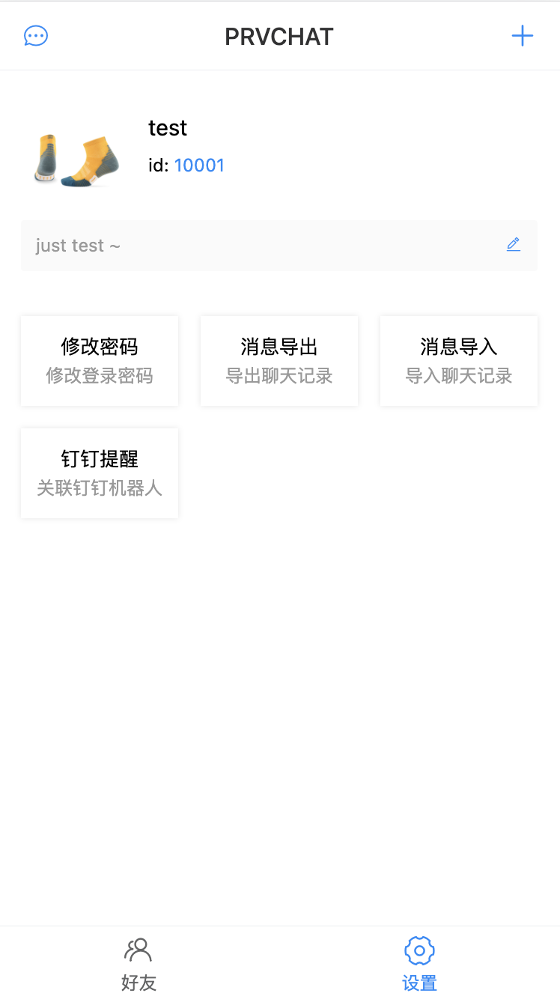
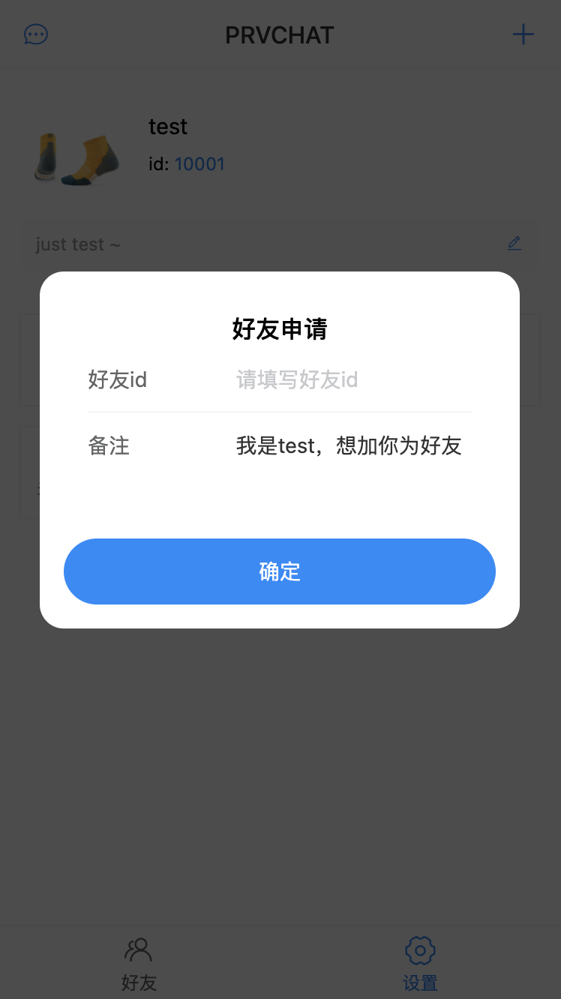

# 私有聊天工具

> 此项目仅做学习使用

后端：koa服务搭建+sequelize数据库处理+wswebsocket服务+jsonwebtoken权限验证

前端：vue3+vite打包+vue-router路由+pinia状态管理+vantui库+node-rsa消息加解密+indexedDB数据存储+fetch请求接口

采用websocket作为实时通讯，rsa对消息进行非对称加密后发送给服务端，服务端通过websocket转发给对应用户，数据传输全程加密，只有接收方使用自身私钥才能解密。未在线的用户通过koa接口获取历史消息。

## 如何使用

1. 克隆项目

```
git clone https://github.com/hyy22/privatechat
```

2. 按需修改docker-compose配置文件

3. 开启服务

```bash
docker-compose up -d
```

## 基础功能

- [x] 注册
- [x] 登录
- [x] 私钥导入导出、重新生成
- [x] 添加好友
- [x] 同意好友请求
- [x] 删除好友
- [x] 删除好友聊天记录
- [x] 文本消息发送
- [x] 图片消息发送
- [x] 个人信息修改
- [ ] 群聊
- [x] 消息通知
- [ ] pwa支持
- [ ] 聊天数据导入导出

## 截图








## 开发过程遇到的问题

### docker-compose打包启动后无法连接数据库

因为depends on只会等待服务启动，不会等到db等初始化完成，所以只用depends on后连接数据库会报错，[https://docs.docker.com/compose/startup-order/](https://docs.docker.com/compose/startup-order/)，需要用到docker官方推荐的脚本[https://github.com/vishnubob/wait-for-it](https://github.com/vishnubob/wait-for-it)

### vite打包报错Buffer is not defined

使用了`node-rsa`包处理加解密，包用到了node相关环境。因为vite缺少node相关环境，需要安装三方兼容包`@esbuild-plugins/node-globals-polyfill`、`@esbuild-plugins/node-modules-polyfill`、..通过插件的方式兼容node环境

